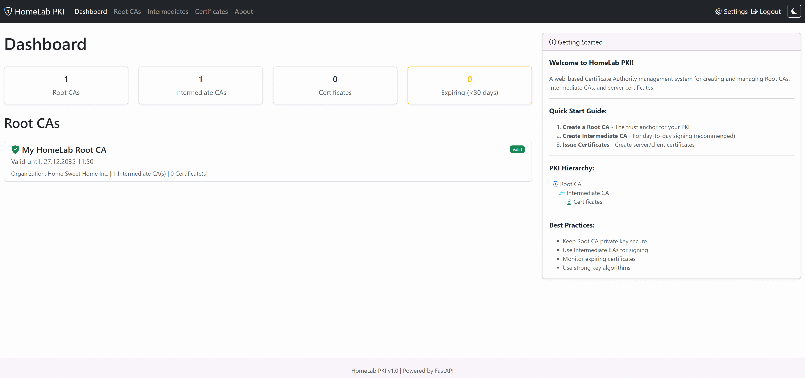

# HomeLab PKI

<div align="center">

**HomeLab PKI** - A web-based Certificate Authority (CA) management system

[](https://github.com/mahmadhuebsch/HomeLabPKI/actions/workflows/ci.yml)
[](https://opensource.org/licenses/MIT)
[](https://www.python.org/downloads/)
[](https://fastapi.tiangolo.com/)
[](https://www.openssl.org/)
[](https://www.docker.com/)

[Features](#features) • [Installation](#installation) • [Configuration](#configuration) • [API](#api-documentation) • [Contributing](#contributing)

</div>

---

## Overview

HomeLab PKI is a web-based Certificate Authority management system built with FastAPI and Bootstrap 5.
It provides comprehensive tools for creating and managing Root CAs, Intermediate CAs, and server certificates through a
streamlined web interface.

Designed for development environments, testing infrastructure, internal PKI deployments, and certificate management operations.



## Features

- **Root CA Management** - Create and manage self-signed Root Certificate Authorities
- **Intermediate CA Support** - Build certificate chains with Intermediate CAs
- **Server Certificates** - Issue certificates with Subject Alternative Names (SANs)
- **Certificate Extensions** - Customize Key Usage and Extended Key Usage with presets (TLS Server, TLS Client, Code Signing, etc.) or custom selection
- **CSR Signing** - Sign external Certificate Signing Requests where private keys are managed externally
- **Importing** - Import and track externally-signed CAs and certificates
- **Multiple Certificate Formats** - View certificates in both Text (human-readable) and PEM formats
- **Modern Web Interface** - Responsive Bootstrap 5 UI with organized navigation
- **Password Protection** - Built-in authentication with configurable session expiration
- **RESTful API** - Complete API with OpenAPI documentation
- **Docker Support** - Easy deployment with Docker
- **Air-Gapped Operation** - Works without internet access (all assets bundled locally)

## Table of Contents

- [Overview](#overview)
- [Features](#features)
- [Requirements](#requirements)
- [Quick Start](#quick-start)
- [Docker Deployment](#docker-deployment)
- [Project Structure](#project-structure)
- [Configuration](#configuration)
- [Authentication](#authentication)
- [API Documentation](#api-documentation)
- [Testing](#testing)
- [Security Considerations](#security-considerations)
- [Contributing](#contributing)
- [Planned Features](#planned-features)
- [License](#license)

## Requirements

- Python 3.10 or higher
- OpenSSL 1.1.1 or higher (must be available in system PATH)

## Quick Start

```bash
# Clone the repository
git clone https://github.com/mahmadhuebsch/HomeLabPKI.git
cd HomeLabPKI

# Create and activate virtual environment
python -m venv .venv

# Activate virtual environment
# On Windows PowerShell: .\.venv\Scripts\Activate.ps1
# On Windows CMD: .venv\Scripts\activate.bat
# On Linux/Mac: source .venv/bin/activate

# Install dependencies
pip install -r requirements.txt

# Verify OpenSSL is available
openssl version

# Start the application
python main.py
```

1. Navigate to `http://localhost:8000`  (Default Password: "admin")
2. Create a Root CA from the dashboard
3. Optionally create an Intermediate CA under the Root CA
4. Issue server certificates as needed

## Docker Deployment

You can easily run HomeLab PKI using Docker.

```bash
# Build the image
docker build -t homelabpki .

# Run the container
# Maps port 8000 and creates a volume for persistent data
docker run -d \
  -p 8000:8000 \
  -v homelabpki_data:/app/ca-data \
  --name homelabpki \
  homelabpki
```

The application will be available at `http://localhost:8000`.

## Project Structure

```
HomeLabPKI/
├── app/
│   ├── api/                  # REST API endpoints
│   │   └── routes/           # API route handlers
│   ├── models/               # Pydantic models
│   ├── services/             # Business logic
│   ├── static/               # Static assets
│   │   ├── css/              # Custom CSS
│   │   ├── js/               # Custom JavaScript
│   │   └── vendor/           # Third-party libraries (Bootstrap, etc.)
│   ├── templates/            # Jinja2 HTML templates
│   ├── utils/                # Utility functions
│   └── web/                  # Web routes
├── tests/                    # Test files
├── ca-data/                  # Runtime CA storage (gitignored)
├── main.py                   # Application entry point
├── config.yaml               # Application configuration
├── requirements.txt          # Production dependencies
├── requirements-dev.txt      # Development dependencies
├── THIRD_PARTY_LICENSES.md   # Third-party library licenses
└── Dockerfile                # Docker build instructions
```

## Configuration

Edit `config.yaml` to customize application behavior:

```yaml
# Example configuration
app:
  title: "HomeLab PKI"
  debug: false

paths:
  ca_data: "./ca-data"      # Certificate storage location
  logs: "./logs"            # Log file location

auth:
  enabled: true             # Enable/disable authentication
  password_hash: null       # Auto-generated on first run (default: "admin")
  session_expiry_hours: 24  # Session timeout

defaults:
  root_ca:
    validity_days: 3650     # 10 years
    key_algorithm: "RSA"
    key_size: 4096

  intermediate_ca:
    validity_days: 1825     # 5 years
    key_algorithm: "RSA"
    key_size: 4096

  server_cert:
    validity_days: 365      # 1 year
    key_algorithm: "RSA"
    key_size: 2048

security:
  warn_on_key_download: true

logging:
  level: "INFO"
```

## Authentication

HomeLab PKI includes built-in password protection with session-based authentication.

### Default Credentials

- **Password**: `admin` (no username required)

### Features

- **Web UI**: Cookie-based sessions with automatic redirect to login page
- **API**: Bearer token authentication for programmatic access
- **Session Management**: Configurable session expiration (default: 24 hours)
- **Password Change**: Available via Settings page or API

### API Authentication

```bash
# Get a session token
curl -X POST http://localhost:8000/api/auth/login \
  -H "Content-Type: application/json" \
  -d '{"password": "admin"}'

# Response: {"token": "uuid-token", "expires_at": "..."}

# Use the token for API requests
curl http://localhost:8000/api/cas \
  -H "Authorization: Bearer <token>"
```

### Password Recovery

If you forget your password, delete the `password_hash` line from `config.yaml` and restart the application. The password will reset to `admin`.

```yaml
auth:
  enabled: true
  password_hash: null  # Delete this line or set to null to reset
  session_expiry_hours: 24
```

### Disabling Authentication

To disable authentication entirely (not recommended for networked deployments):

```yaml
auth:
  enabled: false
```

## API Documentation

HomeLab PKI provides a complete RESTful API with automatic interactive documentation powered by FastAPI.

### Access the API Documentation

- **Swagger UI**: `http://localhost:8000/docs`
- **ReDoc**: `http://localhost:8000/redoc`
- **OpenAPI Schema**: `http://localhost:8000/openapi.json`

## Security Considerations

> **Important**: HomeLab PKI is designed for development, testing, and internal infrastructure. For production PKI, consider enterprise-grade solutions.

### Key Security Notes

- **Private Key Storage**: Private keys are stored unencrypted on disk. It is highly recommended to choose a strong password and/or encrypt the `ca-data` directory at the file system level (e.g. [Cryptomator](https://github.com/cryptomator/cryptomator)).
- **Authentication**: Built-in password protection is enabled by default. Change the default password immediately after installation.
- **HTTPS**: Always use HTTPS when deploying in any networked environment. Consider a reverse proxy (nginx, Caddy) for TLS termination.
- **Backup**: Regularly backup the `ca-data` directory.

### Best Practices

1. **Change Default Password**: Immediately change the default password via Settings after first login
2. **Offline Root CA**: Keep Root CA keys offline, use Intermediate CAs for day-to-day operations
3. **Short-Lived Certificates**: Use shorter validity periods (90-365 days) for server certificates
4. **Regular Rotation**: Rotate certificates before expiration
5. **Monitoring**: Monitor certificate expiration dates from the dashboard

For detailed security information, see [SECURITY.md](SECURITY.md).

## Contributing

Contributions are welcome! Please read our [Contributing Guidelines](CONTRIBUTING.md) before submitting a pull request.

### Development Setup

```bash
# Clone and setup
git clone https://github.com/mahmadhuebsch/HomeLabPKI.git
cd HomeLabPKI
python -m venv .venv
source .venv/bin/activate  # or .venv\Scripts\activate on Windows
pip install -r requirements-dev.txt

# Run tests
pytest tests/ -v

# Format code
black app/ tests/
isort app/ tests/
```

## Planned Features

- [x] Password support
- [ ] Email notifications for expiring certificates
- [ ] ACME Protocol support
- [ ] CRL support
- [ ] Certificate chain import
- [x] Docker containerization

## License

This project is licensed under the **MIT License** - see the [LICENSE](LICENSE) file for details.

---

<div align="center">

Made with :heart: by the HomeLab PKI Contributors

</div>
